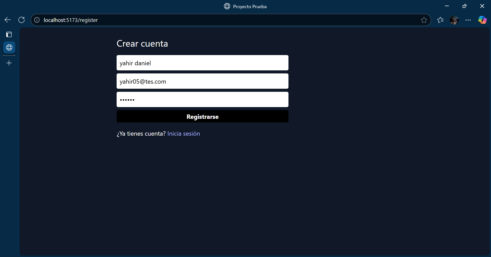
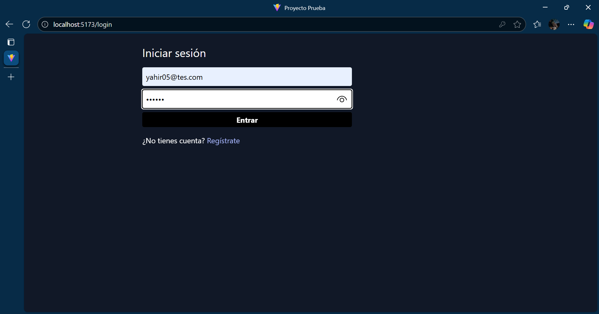
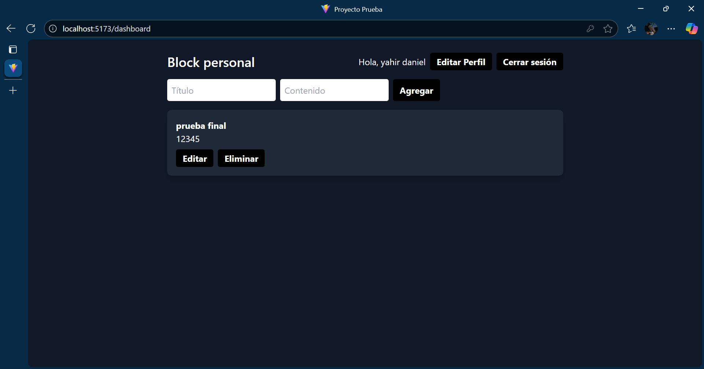

 README - Proyecto Web Node.js + React +
MongoDB

Este proyecto es una aplicación web completa que permite a los usuarios registrarse, iniciar sesión y
gestionar notas personales. Fue desarrollado utilizando una arquitectura cliente-servidor con
**Node.js** (backend), **React** (frontend) y **MongoDB** (base de datos).

■ Estructura del proyecto
• client/ → Contiene el frontend desarrollado en React.
• server/ → Contiene el backend con Node.js, Express y controladores.
• README.md → Archivo de documentación principal del proyecto.

■ Instalación del proyecto
Sigue los siguientes pasos para instalar el proyecto localmente:
• 1. Clonar el repositorio desde GitHub:

``` git clone https://github.com/tu_usuario/proyecto-prueba.git ```
• 2. Entrar a la carpeta del proyecto:

``` cd proyecto-prueba ```
• 3. Instalar dependencias del servidor:

``` cd server npm install ```
• 4. Instalar dependencias del cliente:

``` cd ../client npm install ```
• 5. Iniciar el servidor y el cliente:

``` # Servidor cd server npm run dev # Cliente cd ../client npm run dev ```
■ Pruebas de funcionalidad
Una vez que el proyecto esté ejecutándose, puedes probar las siguientes funciones:
• ■ Registro de usuario: Completa el formulario y verifica que se guarde en MongoDB.
• ■ Inicio de sesión: Verifica que se genere un token JWT o sesión válida.
• ■ Creación de nota: Agrega una nota y revisa que se muestre en la interfaz.
• ■ Edición y eliminación de nota: Comprueba que las acciones actualicen la base de datos.
■ Sección para agregar imágenes

Aquí puedes colocar capturas de pantalla del funcionamiento del proyecto. Ejemplos:
• ■ 
• ■ 
• ■ 
• ■ 
• ■ 

■ Prueba postman
[Descargar colección Postman](./postman/ProyectoPrueba.postman_collection.json)

■ Autor
Proyecto creado por **Yahir Daniel García Peña**.
